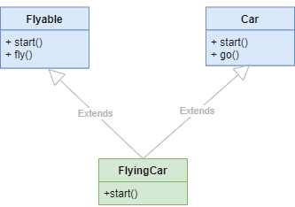

# Inheritance

Suppose we have the following ``Person`` class:

```python
class Person:
    def __init__(self, name):
        self.name = name

    def greet(self):
        return f"Hi, it's {self.name}"
```

The ``Person`` class has the ``name`` attribute and the ``greet()`` method.

Now, we want to define the Employee that is similar to the Person class:

```python
class Employee:
    def __init__(self, name, job_title):
        self.name = name
        self.job_title = job_title

    def greet(self):
        return f"Hi, it's {self.name}"
```

The ``Employee`` class has two attributes ``name`` and ``job_title``.<br> 
It also has the ``greet()`` method that is exactly the same as the ``greet()`` method of the Person class.

To reuse the ``greet()`` method from the ``Person`` class in the ``Employee`` class, we can use inheritance so that the ``Employee`` class inherits from the ``Person`` class.

The following redefines the ``Employee`` class that inherits from the ``Person`` class:

```python
class Employee(Person):
    def __init__(self, name, job_title):
        self.name = name
        self.job_title = job_title
```
<br>

This is a **single inheritance** because the ``Employee`` inherits from a single class ``(Person)``.

The subclass **inherits**:

1. All attributes and methods of the Parent class.
2. Additionally, the subclass can define its own attributes and methods.

### type vs. isinstance vs. issubclass


The following shows the type of instances of the ``Person`` and ``Employee`` classes:

```python
person = Person('Jane')
print(type(person)) # <class '__main__.Person'>

employee = Employee('John', 'Python Developer')
print(type(employee)) # <class '__main__.Employee'>
```

To check if an object is an instance of a class, we use the ``isinstance()`` method. For example:

```python
person = Person('Jane')
print(isinstance(person, Person))  # True

employee = Employee('John', 'Python Developer')
print(isinstance(employee, Person))  # True
print(isinstance(employee, Employee))  # True
print(isinstance(person, Employee))  # False
```

As clearly shown in the output:

-   The ``person`` is an instance of the ``Person`` class.
-   The ``employee`` is an instance of the ``Employee`` class. It’s also an instance of the ``Person`` class.
-   The ``person`` is not an instance of the ``Employee`` class.
<br><br>
The following defines the ``SalesEmployee`` class that inherits from the ``Employee`` class:

```python
class SalesEmployee(Employee):
    pass
```

The ``SalesEmployee`` is the subclass of the ``Employee`` class. It’s also a subclass of the ``Person`` class as shown in the following:

```python
print(issubclass(Employee, Person)) # True
print(issubclass(SalesEmployee, Employee)) # True
print(issubclass(SalesEmployee, Person)) # True
```

Note that when you define a class that doesn’t inherit from any class, it’ll implicitly inherit from the built-in object class.

<div style="background-color: #e0f7fa; color: #000; border: 1px solid #ddd; padding: 10px; border-radius: 8px; box-shadow: 2px 2px 8px rgba(0,0,0,0.1);">
  <strong>Note:</strong> All classes in Python implicitly inherit from the built-in object class.<br><br>
  The <code>Person</code> class in above example <b>inherits</b> from the <code>object</code> class implicitly.
</div>

## Overriding Method

A subclass can override methods from its superclass by defining a method with the same name.

Let’s take an example to understand the overriding method better.<br>
First, define the Employee class:

```python
class Employee:
    def __init__(self, name, base_pay):
        self.name = name
        self.base_pay = base_pay

    def get_pay(self):
        return self.base_pay
```

The Employee class has two instance variables ``name`` and ``base_pay``. It also has the ``get_pay()`` method that returns the base_pay.

Second, define the ``SalesEmployee`` that inherits from the ``Employee`` class:

```python
class SalesEmployee(Employee):
    def __init__(self, name, base_pay, sales_incentive):
        self.name = name
        self.base_pay = base_pay
        self.sales_incentive = sales_incentive
```

The ``SalesEmployee`` class has three instance attributes: ``name``, ``base_pay``, and ``sales_incentive``.

When we call ``get_pay()`` method from the instance of the ``SalesEmployee``, Python executes the ``get_pay()`` method of the ``Employee`` which returns only the ``base_pay``, not the sum of the ``base_pay`` and ``sales_incentive``.

To include the ``sales incentive`` in the pay, we need to redefine the ``get_pay()`` method in the ``SalesEmployee`` class as follows:

```python
class SalesEmployee(Employee):
    def __init__(self, name, base_pay, sales_incentive):
        self.name = name
        self.base_pay = base_pay
        self.sales_incentive = sales_incentive

    def get_pay(self):
        return self.base_pay + self.sales_incentive
```
<br><br>

In this case, we say that the ``get_pay()`` method in the ``SalesEmployee`` class overrides the ``get_pay()`` method in the ``Employee`` class.

When we call the ``get_pay()`` method of the ``SalesEmployee‘s`` object, Python will call the ``get_pay()`` method in the ``SalesEmployee`` class:

```python
john = SalesEmployee('John', 5000, 1500)
print(john.get_pay()) # 6500
```

If you create an instance of the ``Employee`` class, Python will call the ``get_pay()`` method of the ``Employee`` class, not the ``get_pay()`` method of the ``SalesEmployee`` class. For example:

```python
jane = Employee('Jane', 5000)
print(jane.get_pay()) # 5000
```
#### [Please click here for complete code.](Example7.py)

### Advanced Overriding Example - Parser Class

The following defines the ``Parser`` class:

```python
class Parser:
    def __init__(self, text):
        self.text = text

    def email(self):
        match = re.search(r'[a-z0-9\.\-+_]+@[a-z0-9\.\-+_]+\.[a-z]+', self.text)
        if match:
            return match.group(0)
        return None

    def phone(self):
        match = re.search(r'\d{3}-\d{3}-\d{4}', self.text)
        if match:
            return match.group(0)
        return None

    def parse(self):
        return {
            'email': self.email(),
            'phone': self.phone()
        }
```

The ``Parser`` class has an attribute text which specifies a piece of text to be parsed. Also, the Parser class has three methods:

1. The ``email()`` method parses a text and returns the email.
2. The ``phone()`` method parses a text and returns a phone number in the format nnn-nnnn-nnnn where n is a number from 0 to 9 e.g., 408-205-5663.
3. The ``parse()`` method returns a dictionary that contains two elements email and phone. It calls the ``email()`` and ``phone()`` method to extract the email and phone from the text attribute.

The following uses the ``Parser`` class to extract ``email`` and ``phone``:

```python
s = 'Contact us via 408-205-5663 or email@test.com'
parser = Parser(s)
print(parser.parse()) # {'email': 'email@test.com', 'phone': '408-205-5663'}
``` 

Suppose we need to extract phone numbers in the format ``n-nnn-nnn-nnnn``, which is the UK phone number format but we want to use extract email like the ``Parser`` class

To do it, we can define a new class called ``UkParser`` that inherits from the ``Parser`` class. In the UkParser class, we override the ``phone()`` method as follows:

```python
class UkParser(Parser):
    def phone(self):
        match = re.search(r'(\+\d{1}-\d{3}-\d{3}-\d{4})', self.text)
        if match:
            return match.group(0)
        return None
```

The following use the ``UkParser`` class to extract a phone number (in UK format) and email from a text:

```python
s2 = 'Contact me via +1-650-453-3456 or email@test.co.uk'
parser = UkParser(s2)
print(parser.parse()) # {'email': 'email@test.co.uk', 'phone': '+1-650-453-3456'}
```

In this example, the parser calls the ``parse()`` method from the parent class which is the Parser class. In turn, the ``parse()`` method calls the ``email()`` and ``phone()`` methods.

However, the ``parser()`` doesn’t call the ``phone()`` method of the ``Parser`` class but the ``phone()`` method of the ``UkParser`` class.

The reason is that inside the ``parse()`` method, the ``self`` is an instance of the ``UkParser`` class.

Therefore, when we call ``self.phone()`` method inside the ``parse()`` method, Python will look for the ``phone()`` method that is bound to the instance of the ``UkParser``.

## Overriding attributes

```python
class Parser:
    phone_pattern = r'\d{3}-\d{3}-\d{4}'

    def __init__(self, text):
        self.text = text

    def email(self):
        match = re.search(r'[a-z0-9\.\-+_]+@[a-z0-9\.\-+_]+\.[a-z]+', self.text)
        if match:
            return match.group(0)
        return None

    def phone(self):
        match = re.search(self.phone_pattern, self.text)
        if match:
            return match.group(0)
        return None

    def parse(self):
        return {
            'email': self.email(),
            'phone': self.phone()
        }

```

In the above example, the ``Parser`` has a class variable ``phone_pattern``. The ``phone()`` method in the ``Parser`` class uses the ``phone_pattern`` to extract a phone number.

The ``UkParser`` child class redefines (or overrides) the ``phone_pattern`` class attribute :

```python
class UkParser(Parser):
    phone_pattern = r'(\+\d{1}-\d{3}-\d{3}-\d{4})'

```

If we call the ``parse()`` method from the ``UkParser‘s`` instance, the ``parse()`` method calls the ``phone()`` method that uses the ``phone_pattern`` defined in the ``UkParser`` class.

## super()

The ``super()`` function allows us to call methods from the superclass, making it useful in method overriding and initialization.

```python
class Employee:
    def __init__(self, name, base_pay, bonus):
        self.name = name
        self.base_pay = base_pay
        self.bonus = bonus

    def get_pay(self):
        return self.base_pay + self.bonus

class SalesEmployee(Employee):
    def __init__(self, name, base_pay, bonus, sales_incentive):
        super().__init__(name,base_pay,bonus)
        self.sales_incentive = sales_incentive

    def get_pay(self):
        return self.base_pay + self.bonus + self.sales_incentive
```

In above example

1. The ``Employee`` class has three instance variables ``name``, ``base_pay``, and ``bonus``. It also has the ``get_pay()`` method that returns the total of ``base_pay`` and ``bonus``.

2. When we create an instance of the ``SalesEmployee`` class, Python will execute the ``__init__()`` method in the ``SalesEmployee`` class. In turn, ``super().__init__(name,base_pay,bonus)`` method calls the ``__init__()`` method of the ``Employee`` class to initialize the ``name``, ``base_pay``, and ``bonus``.

### Delegating to other methods in the parent class

Note that ``get_pay()`` method of the ``SalesEmployee`` class has some logic that is already defined in the ``get_pay()`` method of the Employee class. 

Therefore, we can reuse this logic in the ``get_pay()`` method of the ``SalesEmployee`` class.

To do that, we can call the ``get_pay()`` method of the ``Employee`` class in the ``get_pay()`` method of ``SalesEmployee`` class as follows:

```python
def get_pay(self):
        return super().get_pay() + self.sales_incentive
```
#### [Please click here for full code](Example8.py)

### Summary of Inheritance in Different Cases


<table style="width:100%; border-collapse:collapse;">
  <tr>
    <th style="border: 1px solid #ddd; padding: 8px;">Type</th>
    <th style="border: 1px solid #ddd; padding: 8px;">Inherited by Subclass</th>
    <th style="border: 1px solid #ddd; padding: 8px;">Access Parent’s Attributes/Methods</th>
    <th style="border: 1px solid #ddd; padding: 8px;">Can Be Overridden</th>
  </tr>
  <tr>
    <td style="border: 1px solid #ddd; padding: 8px;">Instance Attributes</td>
    <td style="border: 1px solid #ddd; padding: 8px;">Yes</td>
    <td style="border: 1px solid #ddd; padding: 8px;">Yes</td>
    <td style="border: 1px solid #ddd; padding: 8px;">Yes</td>
 
  </tr>
  <tr>
    <td style="border: 1px solid #ddd; padding: 8px;">Class Attributes</td>
    <td style="border: 1px solid #ddd; padding: 8px;">Yes</td>
    <td style="border: 1px solid #ddd; padding: 8px;">Yes</td>
    <td style="border: 1px solid #ddd; padding: 8px;">Yes</td>
 
  </tr>
  <tr>
    <td style="border: 1px solid #ddd; padding: 8px;">Instance Methods</td>
    <td style="border: 1px solid #ddd; padding: 8px;">Yes</td>
    <td style="border: 1px solid #ddd; padding: 8px;">Yes</td>
    <td style="border: 1px solid #ddd; padding: 8px;">Yes</td>
 
  </tr>
  <tr>
    <td style="border: 1px solid #ddd; padding: 8px;">Class Methods</td>
    <td style="border: 1px solid #ddd; padding: 8px;">Yes</td>
    <td style="border: 1px solid #ddd; padding: 8px;">Yes</td>
    <td style="border: 1px solid #ddd; padding: 8px;">Yes</td>
 
  </tr>
  <tr>
    <td style="border: 1px solid #ddd; padding: 8px;">Static Methods</td>
    <td style="border: 1px solid #ddd; padding: 8px;">Yes</td>
    <td style="border: 1px solid #ddd; padding: 8px;">No</td>
    <td style="border: 1px solid #ddd; padding: 8px;">Yes</td>
 
  </tr>
</table>

## Multiple Inheritance

To extend multiple classes, we specify the parent classes inside the parentheses () after the class name of the child class like this:

```python
class ChildClass(ParentClass1, ParentClass2, ParentClass3):
   pass
```

``(ParentClass1, ParentClass2, ParentClass3)`` is called is list of inheriting classes.

Let’s take an example to understand how multiple inheritance works:

```python
class Car:
    def go(self):
        print('Going')

class Flyable:
    def fly(self):
        print('Flying')

class FlyingCar(Flyable, Car):
    pass

if __name__ == '__main__':
    fc = FlyingCar()
    fc.go() # Going
    fc.fly() # Flying
```

In the above example:

1. First, define a class ``Car`` that has the ``go()`` method.
2. Second, define a class ``Flyable`` that has the ``fly()`` method.
3. Third, define the ``FlyingCar`` that inherits from both ``Car`` and ``Flyable`` classes
4. Since the ``FlyingCar`` inherits from ``Car`` and ``Flyable`` classes, it reuses the methods from those classes. It means we can call the ``go()`` and ``fly()`` methods on an instance of the FlyingCar class.

### Method resolution order (MRO)
---------
When the parent classes have methods with the same name and the child class calls the method, Python uses the **method resolution order (MRO)** to search for the right method to call. 

Consider the following example:<br><br>


Let's take an example:

```python
class Car:
    def start(self):
        print('Start the Car')

    def go(self):
        print('Going')


class Flyable:
    def start(self):
        print('Start the Flyable object')

    def fly(self):
        print('Flying')


class FlyingCar(Flyable, Car):
    def start(self):
        super().start()

if __name__ == '__main__':
    car = FlyingCar()
    car.start()    # Start the Flyable object    
```

If we create an instance of the ``FlyingCar`` class and call the ``start()`` method, start() method from ``Flyable`` will be called and print ``Start the Flyable object``.

### Why?

The ``__mro__`` will show the mro of the FlyingCar class:

```python
print(FlyingCar.__mro__)
```

**Output:**

```python
(<class '__main__.FlyingCar'>, <class '__main__.Flyable'>, <class '__main__.Car'>, <class 'object'>)
```
From left to right, we'll see :- ``FlyingCar``, ``Flyable``, ``Car``, and ``object``.

When we call the ``start()`` method from the ``FlyingCar‘s`` object, Python uses the __mro__ class search path.

Since the ``Flyable`` class is next to the ``FlyingCar`` class, the ``super().start()`` calls the ``start()`` method of the ``FlyingCar`` class.

<div style="background-color: #e0f7fa; color: #000; border: 1px solid #ddd; padding: 10px; border-radius: 8px; box-shadow: 2px 2px 8px rgba(0,0,0,0.1);">
  <strong>Note:</strong> If we flip the order of <code>Flyable</code> and <code>Car</code> classes in the list of inheriting classes, the __mro__ will change accordingly. 
</div>

## Multiple inheritance & super

``super()`` works with multiple inheritance by following the **Method Resolution Order (MRO)**.

Let's take an example:

```python
class Car:
    def __init__(self, door, wheel):
        self.door = door
        self.wheel = wheel

    def start(self):
        print('Start the Car')

    def go(self):
        print('Going')

class Flyable:
    def __init__(self, wing):
        self.wing = wing

    def start(self):
        print('Start the Flyable object')

    def fly(self):
        print('Flying')

class FlyingCar(Flyable, Car):
    def __init__(self, door, wheel, wing):
        super().__init__(wing=wing)
        self.door = door
        self.wheel = wheel

    def start(self):
        super().start()
```

The method order resolution of the ``FlyingCar`` class is:

```python
(<class '__main__.FlyingCar'>, <class '__main__.Flyable'>, <class '__main__.Car'>, <class 'object'>)
```

``super().__init__()`` calls the ``__init__`` of the ``FlyingCar`` class. Therefore, we need to pass the wing argument to the ``__init__`` method.

Because the FlyingCar class cannot access the ``__init__`` method of the ``Car`` class, we need to initialize the ``door`` and ``wheel`` attributes individually.

**Note :** If we want ``FlyingCar`` to call both ``Flyable`` and ``Car`` initializers, we can explicitly call ``Car.__init__`` alongside ``super()`` as follows:

```python
class FlyingCar(Flyable, Car):
    def __init__(self, door, wheel, wing):
        super().__init__(wing=wing)  # Calls Flyable's __init__
        Car.__init__(self, wheel=wheel,door=door)  # Explicitly calls Car's __init__
        self.door = door
```

#### [Example full Code ](Example9.py)

## Abstract Classes

Python doesn’t directly support abstract classes. But it does offer a module that allows you to define abstract classes.

To define an abstract class, we use the ``abc`` (abstract base class) module.

```python
from abc import ABC


class AbstractClassName(ABC):
    pass
```

To define an abstract method, we use the ``@abstractmethod`` decorator:

```python

from abc import ABC, abstractmethod


class AbstractClassName(ABC):
    @abstractmethod
    def abstract_method_name(self):
        pass
```

### Payroll Program Example
-----

**Problem Statment:** Suppose that we need to develop a payroll program for a company.

The company has two groups of employees: full-time employees and hourly employees. The full-time employees get a fixed salary while the hourly employees get paid by hourly wages for their services.

The payroll program needs to print out a payroll that includes employee names and their monthly salaries.

**Solution:**

To model the payroll program in an object-oriented way, we may come up with the following classes: 

1. Employee
2. FulltimeEmployee
3. HourlyEmployee
4. Payroll

**The Employee class**

The ``Employee`` class represents an employee, either full-time or hourly. The ``Employee`` class should be an abstract class because there’re only full-time employees and hourly employees.

The ``Employee`` class should have a property that returns the full name of an employee and a method that calculates salary. 

The method for calculating salary should be an abstract method.

The following defines the ``Employee`` abstract class:

```python
from abc import ABC, abstractmethod


class Employee(ABC):
    def __init__(self, first_name, last_name):
        self.first_name = first_name
        self.last_name = last_name

    @property
    def full_name(self):
        return f"{self.first_name} {self.last_name}"

    @abstractmethod
    def get_salary(self):
        pass

```

**FulltimeEmployee class**

The ``FulltimeEmployee`` class inherits from the ``Employee`` class. It’ll provide the implementation for the ``get_salary()`` method.

```python
class FulltimeEmployee(Employee):
    def __init__(self, first_name, last_name, salary):
        super().__init__(first_name, last_name)
        self.salary = salary

    def get_salary(self):
        return self.salary # Full-time Employees get fixed salaries 

```

**HourlyEmployee class**

The ``HourlyEmployee`` also inherits from the ``Employee`` class. 

However, ``hourly employees`` get paid by working hours and their rates. Therefore, we can initialize this information in the constructor of the class.

To calculate the salary for the hourly employees, we multiply the working hours and rates.

```python
class HourlyEmployee(Employee):
    def __init__(self, first_name, last_name, worked_hours, rate):
        super().__init__(first_name, last_name)
        self.worked_hours = worked_hours
        self.rate = rate

    def get_salary(self):
        return self.worked_hours * self.rate

```

**The Payroll class**

The ``Payroll`` class will have a method that adds an employee to the employee list and print out the payroll.The following shows the ``Payroll`` class:

```python
class Payroll:
    def __init__(self):
        self.employee_list = []

    def add(self, employee):
        self.employee_list.append(employee)

    def print(self):
        for e in self.employee_list:
            print(f"{e.full_name} \t ${e.get_salary()}")

```

#### [Full Example Code](Payroll/app.py)

