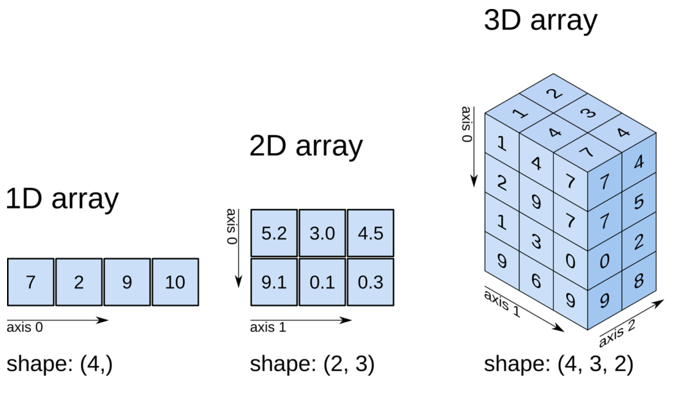

# Introduction to NumPy

1. NumPy stands for Numerical Python and is pronounced as /ˈnʌmpaɪ/. 

2. Numpy is a Python library that performs numerical calculations.

3. NumPy is very fast because it is written in the C programming language.

4. NumPy is built on **linear algebra**(It’s about matrices and vectors and performing the mathematical calculations on them).

5. The key concept in NumPy is the **NumPy array data type**. A NumPy array may have one or more dimensions:

    -   One dimension arrays (1D) represent vectors
    -   Two-dimensional arrays (2D) represent matrices
    -   And higher dimensional arrays represent tensors.

6. NumPy array requires homogeneous data values that means it arrays allow only one data type for all elements. 