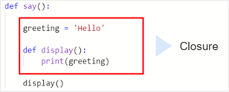
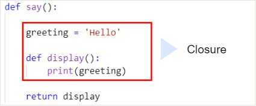
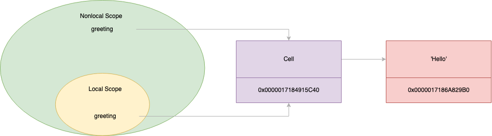

# Python Closures

In Python, we can define a ``function`` from the inside of another function and this function is called a ``nested function``. For example:

```python
def say():
    greeting = 'Hello'

    def display():
        print(greeting)

    display()
```

Inside the ``display`` function, we access the ``greeting`` variable from its ``nonlocal`` scope.

Python calls the ``greeting`` variable a **free variable**.

When we look at the display function, we actually look at:

1. The ``display`` function itself.
2. And the free variable greeting with the value ``'Hello'``.

So the combination of the ``display`` function and ``greeting`` variable is called a **closure**:



By definition, **a closure is a nested function that references one or more variables from its enclosing scope.**

### Returning an inner function

In Python, a function can return a value which is another function. For example:

```python
def say():
    greeting = 'Hello'

    def display():
        print(greeting)

    return display    

fn = say()
fn() # Hello
```

In this example, the ``say`` function returns the display function instead of executing it which is actually a **closure**.



When the ``fn`` function executes, the say function already completes.

In other words, the scope of the ``say`` function was gone at the time the fn function executes.

Since the ``greeting`` variable belongs to the scope of the ``say`` function, it should also be destroyed with the scope of the function. 

However, we still see that ``fn`` displays the value of the ``message`` variable.

### Python cells and multi-scoped variables


When you have a nested function that references a variable from an outer (enclosing) function, Python creates a cell object to holds the reference to that variable. 
This mechanism allows the nested function (or any inner function) to maintain access to that variable even after the outer function has completed execution.

Both the outer & nested function’s scope contains a reference to the cell object.

In essence, 

-   A cell object is a wrapper around a variable’s value, created whenever a variable is referenced across multiple scopes.
-   The inner function’s local scope will have references (not copies) to these cell objects.

Let’s look at an example to see how cell objects operate under the hood:

The value of ``greeting`` variable is shared between two scopes of:

1. The ``say`` function -> outer function
2. The ``display`` function -> nested function

The label ``greeting`` is in two different scopes. However, they always reference the same string object with the value ``'Hello'``.

To achieve this, Python creates an intermediary object called a cell:



#### Under the Hood: Accessing Cell Objects

We can inspect the closure of fn using its ``__closure__`` attribute, which provides access to any cell objects created in the enclosing scope. Here’s how it looks in Python:

To find the memory address of the cell object, we can use the ``__closure__`` property as follows:

```python
print(fn.__closure__)
print(fn.__closure__[0].cell_contents) 
```

**Output:**

```python
(<cell at 0x0000017184915C40: str object at 0x0000017186A829B0>,)
Hello
```

The __closure__ returns a tuple of cells.

In this example, the memory address of the cell is ``0x0000017184915C40``. It references a string object at ``0x0000017186A829B0``.

If we display the memory address of the string object in the say ``function`` and ``closure``, we should see that they reference the same object in the memory:

```python
def say():
    greeting = 'Hello'
    print(hex(id(greeting)))

    def display():
        print(hex(id(greeting)))
        print(greeting)

    return display


fn = say()
fn()
```

**Output**

```
0x17186a829b0
0x17186a829b0
```

When we access the value of the ``greeting`` variable, Python will technically “double-hop” to get the string value.

This explains why when the ``say()`` function was out of scope, we still can access the string object referenced by the ``greeting`` variable.

Based on this mechanism, we can think of **a closure as a function and an extended scope that contains free variables**.

To find the free variables that a closure contains, you can use the ``__code__.co_freevars``

```python
def say():

    greeting = 'Hello'

    def display():
        print(greeting)

    return display


fn = say()
print(fn.__code__.co_freevars)
```

**Output:**

```
('greeting',)
```

#### Multiple Variables in Closures

If multiple variables are captured by closures, each one gets its own cell object.

```python
def outer_function():
    a = "Variable A"
    b = "Variable B"
    
    def inner_function():
        print(a, b)  # Accessing both a and b from the enclosing scope
    
    return inner_function

closure_func = outer_function()
closure_func()  # Output: Variable A Variable B

print(closure_func.__closure__) # (<cell at 0x10492dcf0: str object at 0x1049604f0>, <cell at 0x10492dd20: str object at 0x104960530>)
print(closure_func.__closure__[0].cell_contents)  # Output: Variable A
print(closure_func.__closure__[1].cell_contents)  # Output: Variable B
```
Each variable from the outer scope (a and b) is captured in its own cell object, and both are accessible within inner_function.

#### Closures with Dynamic Function Creation

One powerful use of closures is in creating functions dynamically. By capturing values in cell objects, closures allow you to generate customized functions with specific states:

```python
def multiplier(x):
    def multiply(y):
        return x * y
    return multiply

# m1, m2, and m3 have different instances of closure
m1 = multiplier(1) 
m2 = multiplier(2) 
m3 = multiplier(3)    

print(m1(10)) # 10
print(m2(10)) # 20
print(m3(10)) # 30
```

Here’s the breakdown:

-   ``multiplier`` takes ``x`` as an argument and returns a ``multiply`` function that multiply it's ``y`` parameter to this ``x``.
-   Each ``multiply`` function retains access to the ``x`` through a cell object, even after ``multiplier`` has returned.

#### Closures with ``for loop``

```python

def multiplier(x):
    def multiply(y):
        return x * y
    return multiply

multipliers = []

for x in range(1, 4):
    multipliers.append(multiplier(x))

m1, m2, m3 = multipliers

print(m1(10)) # 10
print(m2(10)) # 20
print(m3(10)) # 30
```
