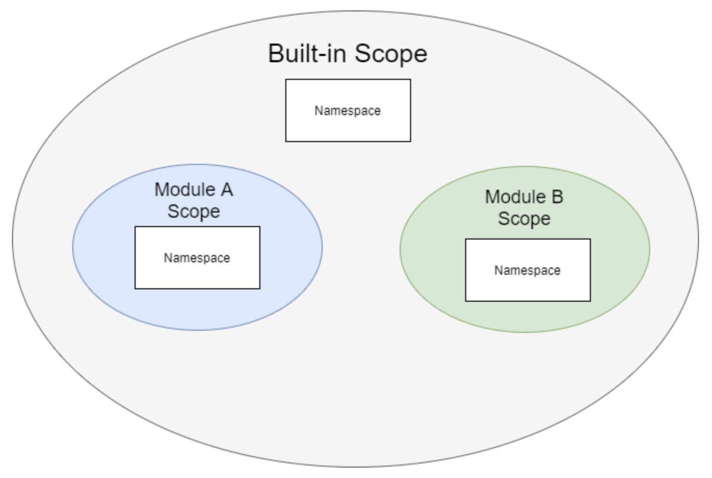
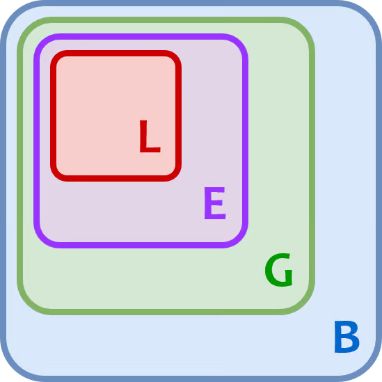
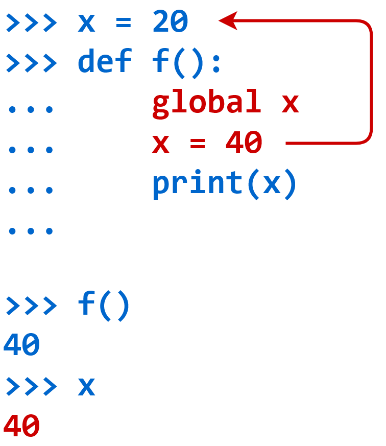
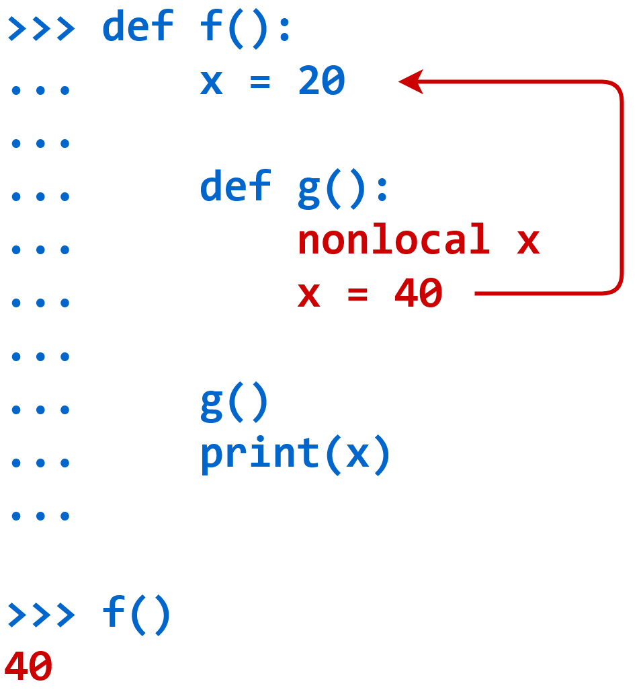

# Namespaces and Scope

An assignment statement creates a **symbolic** name that you can use to reference an object. 

The statement ``x = 'foo'`` creates a symbolic name x that refers to the string object 'foo'.

A **namespace** in python is a collection of currently defined symbolic names along with information about the object that each name references.

In a Python program, there are four types of namespaces:

1. Built-In
2. Global
3. Enclosing
4. Local

These have differing lifetimes. As Python executes a program, it creates namespaces as necessary and deletes them when they’re no longer needed. Typically, many namespaces will exist at any given time.

### The Built-In Namespace

The built-in namespace contains the names of all of Python’s built-in objects. These are available at all times when Python is running. 

You can list the objects in the built-in namespace with the following command:

```python
print(dir(__builtins__))
```

<details>
  <summary style="font-weight: bold;">Output</summary>
  <pre><code>
  # ['ArithmeticError', 'AssertionError', 'AttributeError', 'BaseException', 'BaseExceptionGroup', 'BlockingIOError', 'BrokenPipeError', 'BufferError', 'BytesWarning', 'ChildProcessError', 'ConnectionAbortedError', 'ConnectionError', 'ConnectionRefusedError', 'ConnectionResetError', 'DeprecationWarning', 'EOFError', 'Ellipsis', 'EncodingWarning', 'EnvironmentError', 'Exception', 'ExceptionGroup', 'False', 'FileExistsError', 'FileNotFoundError', 'FloatingPointError', 'FutureWarning', 'GeneratorExit', 'IOError', 'ImportError', 'ImportWarning', 'IndentationError', 'IndexError', 'InterruptedError', 'IsADirectoryError', 'KeyError', 'KeyboardInterrupt', 'LookupError', 'MemoryError', 'ModuleNotFoundError', 'NameError', 'None', 'NotADirectoryError', 'NotImplemented', 'NotImplementedError', 'OSError', 'OverflowError', 'PendingDeprecationWarning', 'PermissionError', 'ProcessLookupError', 'RecursionError', 'ReferenceError', 'ResourceWarning', 'RuntimeError', 'RuntimeWarning', 'StopAsyncIteration', 'StopIteration', 'SyntaxError', 'SyntaxWarning', 'SystemError', 'SystemExit', 'TabError', 'TimeoutError', 'True', 'TypeError', 'UnboundLocalError', 'UnicodeDecodeError', 'UnicodeEncodeError', 'UnicodeError', 'UnicodeTranslateError', 'UnicodeWarning', 'UserWarning', 'ValueError', 'Warning', 'ZeroDivisionError', '__build_class__', '__debug__', '__doc__', '__import__', '__loader__', '__name__', '__package__', '__spec__', 'abs', 'aiter', 'all', 'anext', 'any', 'ascii', 'bin', 'bool', 'breakpoint', 'bytearray', 'bytes', 'callable', 'chr', 'classmethod', 'compile', 'complex', 'copyright', 'credits', 'delattr', 'dict', 'dir', 'divmod', 'enumerate', 'eval', 'exec', 'exit', 'filter', 'float', 'format', 'frozenset', 'getattr', 'globals', 'hasattr', 'hash', 'help', 'hex', 'id', 'input', 'int', 'isinstance', 'issubclass', 'iter', 'len', 'license', 'list', 'locals', 'map', 'max', 'memoryview', 'min', 'next', 'object', 'oct', 'open', 'ord', 'pow', 'print', 'property', 'quit', 'range', 'repr', 'reversed', 'round', 'set', 'setattr', 'slice', 'sorted', 'staticmethod', 'str', 'sum', 'super', 'tuple', 'type', 'vars', 'zip']
  </code></pre>
</details>


The Python interpreter creates the built-in namespace when it starts up. This namespace remains in existence until the interpreter terminates.

### The Global Namespace

The global namespace contains any names defined at the level of the main program. Python creates the global namespace when the main program body starts, and it remains in existence until the interpreter terminates.

**Strictly speaking**, this may not be the only global namespace that exists. The interpreter also creates a global namespace for any **module** that program loads with the ``import`` statement. 

Internally, global scopes are nested inside the built-in scope:



### The Local and Enclosing Namespaces

The interpreter creates a new namespace whenever a function executes. That namespace is local to the function and remains in existence until the function terminates.

```python
def f():
     print('Start f()')
     def g():
         print('Start g()')
         print('End g()')
         return

     g()

     print('End f()')
     return

f()
Start f()
Start g()
End g()
End f()
```

When the main program calls ``f()``, Python creates a new namespace for ``f()``. Similarly, when ``f()`` calls ``g()``, ``g()`` gets its own separate namespace. 

The namespace created for ``g()`` is the **local namespace**, and the namespace created for ``f()`` is the **enclosing namespace**.

Each of these namespaces remains in existence until its respective function terminates.

### Variable Scope

Suppose we refer to the name x in your code, and x exists in several namespaces. How does Python know which one you mean?

The answer lies in the concept of **scope**. The scope of a variable refers to the region or context within a program where a variable is accessible. 

If our code refers to the name x, then Python searches for x in the following namespaces in the order shown:

1. **Local:** If you refer to x inside a function, then the interpreter first searches for it in the innermost scope that’s local to that function.
2. **Enclosing:** If x isn’t in the local scope but appears in a function that resides inside another function, then the interpreter searches in the enclosing function’s scope.
3. **Global:** If neither of the above searches is fruitful, then the interpreter looks in the global scope next.
4. **Built-in:** If it can’t find x anywhere else, then the interpreter tries the built-in scope.

This is the **LEGB** rule as it’s commonly called in Python literature.The interpreter searches for a name from the inside out, looking in the **l**ocal, **e**nclosing, **g**lobal, and finally the **b**uilt-in scope:



If the interpreter doesn’t find the name in any of these locations, then Python raises a **NameError exception**.

### Python Namespace Dictionaries

Python implement global and local namespaces as dictionaries.The built-in namespace doesn’t behave like a dictionary. Python implements it as a module.

### The globals() function

The built-in function globals() returns a reference to the current global namespace dictionary. 

```python
x = 'foo'

type(globals()) 

print(globals())

"""
Output : 

#<class 'dict'>

{'__name__': '__main__', '__doc__': None, '__package__': None,
'__loader__': <class '_frozen_importlib.BuiltinImporter'>, '__spec__': None,
'__annotations__': {}, '__builtins__': <module 'builtins' (built-in)>,
'x': 'foo'}
"""
```

>Note : We would typically access this object in the usual way, by referring to its symbolic name, x. But we can also access it indirectly through the global namespace dictionary:
>
>```python
>globals()['x'] # foo
>x is globals()['x'] #True
>```
>
>We can also create and modify entries in the global namespace using the globals() function as well:
>
>```python
>globals()['y'] = 100
>print(y) # 100
>globals()['y'] = 50
>print(y) # 50
>```

### The locals() function

Python also provides a corresponding built-in function called locals(). It’s similar to globals() but accesses objects in the local namespace instead:

```python
def f(x, y):
     s = 'foo'
     print(locals())

f(10, 0.5) # {'s': 'foo', 'y': 0.5, 'x': 10}     
```

Notice that, in addition to the locally defined variable s, the local namespace includes the function parameters x and y since these are local to f() as well.

If we call **locals()** outside a function in the main program, then it behaves the same as **globals()**.

#### A Subtle Difference Between ``globals()`` and ``locals()``

``globals()`` returns an actual reference to the dictionary that contains the global namespace. 

``locals()``, on the other hand, returns a dictionary that is a current copy of the local namespace, not a reference to it. 

### The global Declaration


**Case 1** : A function can’t modify an immutable object outside its local scope at all:

```python
 x = 20
 def f():
     x = 40
     print(x)


 f() # 40
 print(x) # 20
```

When ``f()`` executes the assignment ``x = 40``, it creates a new local reference to an integer object whose value is 40. At that point, ``f()`` loses the reference to the object named ``x`` in the global namespace. So the assignment statement doesn’t affect the global object.

Note that when f() executes print(x) on line 4, it displays 40, the value of its own local x. But after f() terminates, x in the global scope is still 20.


**Case 2:** A function can modify an object of mutable type that’s outside its local scope if it modifies the object in place:

```python
 my_list = ['foo', 'bar', 'baz']
 def f():
...     my_list[1] = 'quux'
...
 f()
 print(my_list) # ['foo', 'quux', 'baz']
```

In this case, ``my_list`` is a list, and lists are mutable. ``f()`` can make changes inside ``my_list`` even though it’s outside the local scope.

But if ``f()`` tries to reassign my_list entirely, then it will create a new local object and won’t modify the global ``my_list``:

```python
my_list = ['foo', 'bar', 'baz']
def f():
    my_list = ['qux', 'quux']

f()
my_list
```

If we really do need to modify a value in the global scope from within f(), we can do it using **global** keyword as follows:

```python
 x = 20
 def f():
     global x
     x = 40
     print(x)


 f() # 40
 print(x) # 40

```

The global ``x`` statement indicates that while ``f()`` executes, references to the name x will refer to the x that is in the global namespace. That means the assignment ``x = 40`` doesn’t create a new reference. It assigns a new value to ``x`` in the global scope instead:



If the name specified in the global declaration doesn’t exist in the global scope when the function starts, then a combination of the global statement and an assignment will create it:

```python
def g():
     global y
     y = 20


 g()
 print(y) # 20
```

In this case, there’s no object named ``y`` in the global scope when ``g()`` starts, but ``g()`` creates one with the global ``y``.

We can also specify several comma-separated names in a single global declaration:

```python
 x, y, z = 10, 20, 30

 def f():
     global x, y, z

```

A name specified in a global declaration can’t appear in the function prior to the global statement:

```python
 def f():
     print(x)
     global x
___________________________________________
  File "<stdin>", line 3
SyntaxError: name 'x' is used prior to global declaration
```
### The nonlocal Declaration

What if an enclosed function needs to modify an object in the enclosing scope? 

To modify object in the enclosing function from inside enclosed function, you need the analogous keyword nonlocal. 

```python
 def f():
     x = 20

     def g():
         nonlocal x
         x = 40

     g()
     print(x)


 f() # 40
```

After the nonlocal x statement, when g() refers to x, it refers to the x in the nearest enclosing scope,whose definition is in f().

